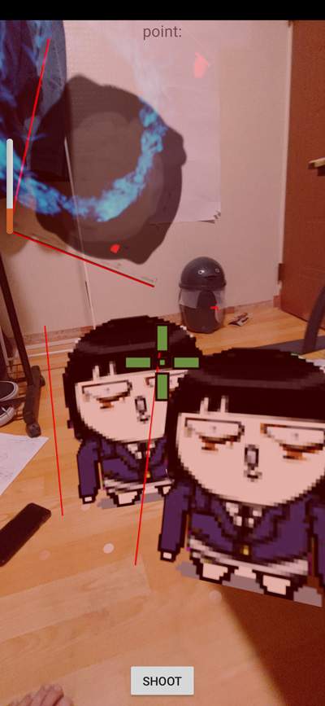

작업일지 220705   

내가 가진 안드로이드폰이 너무 낡아서(API 19) ~~10만원을 빌려서(경제적으로 어려워서 현재 하루천원으로 생활하는 중)~~ 중고폰을 사 AR 작업중에 있다.
(예전에 아는 동생이 애플에 개발자 등록할 돈이 없다고 내꺼 좀 빌려달라고 해서 내가 10만원도 없냐고 했는데 내가 지금 그렇게 되었다)   
(돌아보면 그냥 그때 그 동생에게 내가 한 50만원 줄 걸 그랬다. 줘도 받지도 않았을 테지만)
   
   

최신인 sceneform 1.16.0을 사용하고자 하시는 분이 있다면 말리고 싶다.

1.16.0과 나의 첫만남 
- 제공하는 기본 예제가 바로 crash되었다.
- 문제가 생길 때 자료 구하기가 싶지 않다.
- custom material을 적용할 수 있다고 하지만 fillament에서 제공하는 matc.exe로 컴파일은 잘 되었지만 어플 실행시 바로 crash되었다.

위와 같은 이유로 1.15.0을 사용하기로 했다.
(참고로 1.17.1과 1.15.0은 동일한 하다고 공식페이지에 나와있다)
(1.17.0 소스를 잠깐 보면 모델과 material을 분리하려고 했던 흔적을 볼 수 있다)
(아마 분리하려다가 실패한 것 같다. )

sceneform 1.15.0(=1.17.1) + billboard + custom material    
sceneform에 빌보드를 추가한 스샷이다.   위 파란색 이팩트 효과는 blending add를  적용하기 위해 fragment(pixel) shader를 적용한 것이다.
(빌보드를 추가하려면 Quad(vertex 4개인 면)를 추가해야 하는데 기본으로 제공하는 편의 함수로는 어려워서 직접 작성해야 한다.
(OpenGL을 한번도 공부 안 한신 분이라면 살짝 어려울 수도 있다)
(sceneform은 굉장히 자유도가 떨어진다 ~~sceneform을 기반으로 프로젝트를 운영하는 팀이 있다면 말리고 싶다~~) 

sceneform에 새로운 material을 추가하는 것은 약간 조잡스럽다
자신이 원하는 material을 추가하기 위해서는 fragment shader만 추가해서는 안되고 해당 material에 연동되는 모델을 함께 등록해야 한다.

즉 material이 필요할 때마다 dummy.obj 등을 만들어서 함께 추가해야 한다.

또 build.gradle에 아래와 같이 추가시켜야 한다.

<pre><code>
//-- build.gradle(app수준) --
sceneform.asset('sampledata/effect/effect.obj',
        'sampledata/effect/effect.mat', <----작성한 material
        'sampledata/effect/effect.sfa',
        'src/main/res/raw/effect'
)

//--관련 shader--- 
material {

   parameters: [
       
	       {
               type: "sampler2d" ,
               name: "baseColorMap"
           }
           ,
           {
                  type: float,
                  name:"offsetX"
           }

           ,
           {
                  type: float,
                  name:"offsetY"
           }

       ],

       requires: [

               "uv0"
           ],

    blending : add,
    shadingModel : unlit,
    doubleSided : true,
    culling : none

}

fragment {

    void material(inout MaterialInputs material) {

        prepareMaterial(material);

        vec2 uv = getUV0();
        uv.x = uv.x + materialParams.offsetX;
        uv.y = uv.y + materialParams.offsetY;

        float4 texSample = texture(materialParams_baseColorMap, uv);
        material.baseColor = texSample;

    }
}
</code></pre>

참고로 custom material관련 정보는 아래 링크를 참고하면 된다.   
[custom_material-reference](https://developers.google.com/sceneform/develop/custom-material){:target = '_blank'}  
[custom_material 적용 예제](https://medium.com/@benjdoherty/custom-materials-with-google-sceneform-and-arcore-a930a30f867d){:target='_blank'}   
